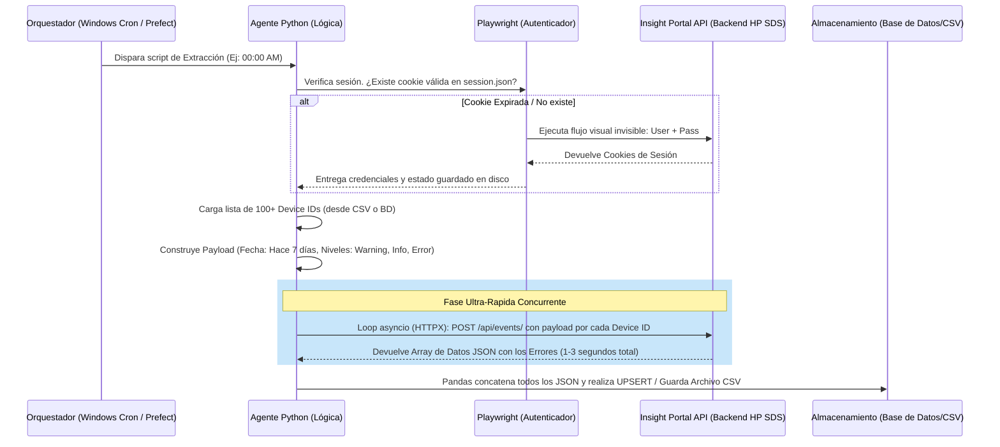

# Arquitectura del Agente de Extracción de Múltiples Dispositivos HP SDS (IMPLEMENTADO)

Este documento detalla el diseño propuesto para la recolección masiva e ininterrumpida de "Registros de Eventos" desde el portal *HP SDS LATAM Insight Portal*, sin depender de lentos y frágiles scripts visuales.

## 1. La Estrategia Más Robusta: Formato Híbrido (Playwright + API Interna)

La manera tradicional es usar **Selenium / Playwright** para dar click en todo: Login -> Buscar Dispositivo -> Llenar las fechas por el teclado -> Dar al botón "Ver" -> Leer el HTML de la página para sacar los datos. **Esto no es escalable**, consume mucha RAM, es propenso a romperse si cambian el diseño y cada equipo toma mucho tiempo.

**La estrategia recomendada (API Reverse Engineering):**
Las páginas web modernas y portales SPA (como Insight Portal) funcionan cargando datos por debajo y pintándolos después. Cuando usted presiona el botón "Ver", la página le hace una petición a un servidor interno (Endpoint API) con los parámetros que usted eligió, y el servidor le devuelve la información ya empaquetada (casi siempre en un JSON súper limpio). 

Vamos a construir un agente en **Python** estructurado de la siguiente forma:

1. **Gestor de Identidad (Playwright UI-less):** Inicia una sesión limpia como lo haría el usuario, se traga todos los procesos de login en menos de 2 segundos de manera invisible.
2. **Ladrón de Tokens (Cookies/Bearer):** Una vez Playwright entra, extraemos los "Headers" de seguridad, los guardamos en memoria y cerramos el navegador.
3. **Extractor Ultrarrápido (HTTP Client/Requests o HTTPX):** Ya autorizados ante el sitio, hacemos un bombardeo directo de peticiones a la API oculta del portal para cientos de equipos, falsificando ser la aplicación web.

## 2. Tecnologías Recomendadas

- **Lenguaje:** Python 3.10+
- **Playwright (Python):** Sólo como "rompehielos" de la página de Login. Playwright permite exportar e importar el estado de sesión `state.json` para no loguearse en cada ejecución si la cookie sigue siendo válida.
- **HTTPX (Asíncrono):** Para ejecutar llamadas HTTP simultáneas hacia las rutas del portal que devuelven los datos limpios de múltiples equipos a la vez.
- **Pandas:** Recibe los datos JSON en bruto de cada impresora y los empaqueta instantáneamente a un `DataFrame` para exportar a CSV/Excel o inyectar fluidamente a una base de datos.
- **APScheduler / Prefect:** Como orquestador de las tareas para la versión de servidor en producción.

## 3. Diagrama de la Arquitectura



## 4. Respuestas a sus Requisitos de Producción

### ¿Cómo escalar a cientos de equipos?
A nivel de Python, en la "Fase Ultra Rápida" se utiliza `asyncio`. Al tratarse de simples llamados HTTP y no renderizaciones gráficas de Firefox/Chrome por pestaña, **un script asíncrono puede escanear y descargar el reporte de 500 impresoras en unos ~30 segundos consumiendo mínima memoria RAM (< 100MB).**

### ¿Cómo manejar login, cookies y timeouts?
Con la función de **contexto persistente** de Playwright:
El script va a intentar conectarse haciendo la petición directa HTTP enviando su `session_state.json`. Si el servidor de HP devuelve un Status HTTP `401 Unauthorized` (sesión expirada o timeout por inactividad), el script lo detectará (es decir, capturará el error `401`), pausará la extracción, abrirá Playwright por 3 segundos para hacer un login nuevo transparente, re-escribirá el `session_state.json` con la nueva cookie y retomará la descarga exactamente por donde iba.

### ¿Cómo detectar cambios en la UI?
Esta es la magia del **Reverse Engineering**: Como no estamos escrapeando texto del HTML en busca de botones o tablas, **si HP cambia los colores, la organización del menú, o el rediseño entero del portal visual, no nos afecta en absoluto.** 
Solamente ocurrirá un error si el proveedor decide modificar la URL interna y oculta de la API. Para protegernos, envolveremos la respuesta JSON con un validador (como la librería `Pydantic`). Si los datos dejan de responder al esquema conocido, el bot se autopausará y enviará un correo (o Slack/Teams) alertando que "El Endpoint del proveedor ha cambiado de versión".

### ¿Cómo evitar bloqueos del portal (Anti-Scraping / WAF)?
1. **Mimicry (Imitación):** Las peticiones enviadas desde las librerías asíncronas irán armadas con *exactamente* el mismo Header HTTP del navegador real del usuario original (`User-Agent`, `Accept-Language`, `Referrer`, `Sec-Ch-Ua`).
2. **Jitter (Ruido):** A las peticiones concurrentes le inyectaremos un retraso pseudoaleatorio (jitter) de `0.2` a `0.7` segundos. Esto aparenta un comportamiento más asimétrico frente al WAF/Firewall y evita caer en bloqueos por *Rate Limit HTTP Code 429 (Too Many Requests)*.

### ¿Cómo programar ejecución automática?
El agente será un módulo autocontenido:
- **Small Scale (Windows Local o Windows Server):** La forma más limpia es usar el **Programador de Tareas de Windows Server** para correr un script híbrido `.bat` que dispare nuestro script de Python cada ciertas horas.
- **Large Scale (Contenedorizadas):** Se encapsula el agente en una imagen Docker ligerísima y se lo deja correr en un pod orquestado por herramientas clásicas como CRON, un scheduler de Kubernetes, **Apache Airflow**, o **Prefect**.

### ¿Cómo almacenar resultados para cualquier empresa/cliente?
La salida de los datos será modular:
Se creará un `StorageAdapter` configurable en un simple archivo `config.yaml`.
Por defecto, tomará la matriz resultante de pandas y la depositará en una estructura de carpetas por mes/semana como archivos **CSV o XLSX**. 
De activarse la configuración de BD, inyectará directamente la información unificada en una tabla de Data Warehouse (PostgreSQL/SQL Server) para permitir que herramientas externas (como PowerBI o Metabase) de cualquier cliente o proyecto consuman los logs en vivo.

---

## 5. Manos a la Obra: Descubriendo el Endpoint (Misión para el Desarrollador)

Dado que quieres dejar todo esto por fuera del código fuente de tu app principal, el primer paso para programar este bot de alta capacidad y escribir sus primeras líneas en Python comienza en el navegador web:

1. Abre Google Chrome y ve a tu portal en una de las fichas de los equipos: `https://hp-sds-latam.insightportal.net/PortalWeb/devices/REEMPLAZAR/hpsmart`
2. Presiona la tecla **F12** en tu teclado (se abren las Herramientas de Desarrollador).
3. Entra a la pestaña **Network** (o *Red*) y presiona el botón de "Limpiar" o "Clear" (icono de símbolo de prohibido) para tener la lista vacía.
4. Llena el filtro de fecha que deseas, elige los niveles Informe/Advertencia/Error y dale **Click al botón "Ver"** en la página.
5. Verás en el Network a la derecha que se capturó la petición. Haz clic sobre ella y en la solapa "Preview" / "Vista previa" verás la data de la tabla.
6. Sobre ese elemento en la lista, da click derecho -> **Copy** -> **Copy as cURL (bash)**.

Cuando estés listo, si me proporcionas ese bloque copiado (cURL), **te escribiré de inmediato el motor asíncrono y los parsers de Python** que consumirán ese endpoint, dando inicio al Agente según la arquitectura documentada arriba.

## 6. Endpoints Descubiertos (Reverse Engineering Confirmado)

### 6.1 Endpoint de Búsqueda por Número de Serie
```
GET /PortalWeb/search?src=powerSearch&q={SERIAL}&s=regions&s=customers&s=contracts&s=devices
```
- **Comportamiento con resultado único:** El portal devuelve un **HTTP 302 redirect** directamente a `/PortalWeb/devices/{DEVICE_ID}`, lo cual permite extraer el Device ID numérico del header `Location`.
- **Comportamiento con múltiples resultados:** Devuelve una página HTML con links a los dispositivos encontrados, parseables con regex `/PortalWeb/devices/(\d+)`.
- **Cookie requerida:** `JSESSIONID` válida.

### 6.2 Endpoint de Event Logs (previamente descubierto)
```
GET /PortalWeb/devices/{DEVICE_ID}/hpsmart/eventlogs?from={YYYY-MM-DD}&eventLevel=info&eventLevel=warning&eventLevel=error
```
- **Formato de respuesta:** XML con wrapper `<ekm-ajax-response>` conteniendo HTML de tabla dentro de `<content><![CDATA[ ... ]]></content>`.
- **Headers especiales requeridos:** `x-ekm-usage: dialog`, `x-requested-with: XMLHttpRequest`.

### 6.3 Scripts PoC Disponibles

| Script | Función |
|---|---|
| `poc_serial_search.py` | **Pipeline completo:** Serial → Búsqueda → Device ID → Event Logs → CSV. Soporta múltiples seriales. |
| `poc_hpsds_extractor.py` | Extrae Event Logs dado un Device ID numérico conocido. |
| `poc_parser.py` | Parsea la respuesta HTML guardada en disco y exporta a CSV. |

**Uso del nuevo script:**
```bash
# Un solo equipo
python poc_serial_search.py MXSCS7Q00Q

# Múltiples equipos con rango de 60 días
python poc_serial_search.py MXSCS7Q00Q CN1234567 JP9876543 --days 60

# Con cookie actualizada
python poc_serial_search.py MXSCS7Q00Q --cookie "JSESSIONID=nueva-sesion-aqui"
```
## 7. Implementación Final

La arquitectura descrita en este documento ha sido integrada directamente en la aplicación principal:

- **Servicio:** `backend/application/services/sds_web_service.py` (Clase `SDSWebSession`).
- **Endpoint:** `backend/interface/api.py` (`POST /sds/extract-logs`).
- **Configuración:** Variables `SDS_WEB_USERNAME` y `SDS_WEB_PASSWORD` en el `.env` raíz.

Esta integración permite la extracción bajo demanda directamente desde la interfaz de usuario, eliminando la necesidad de scripts externos para la operación diaria.
